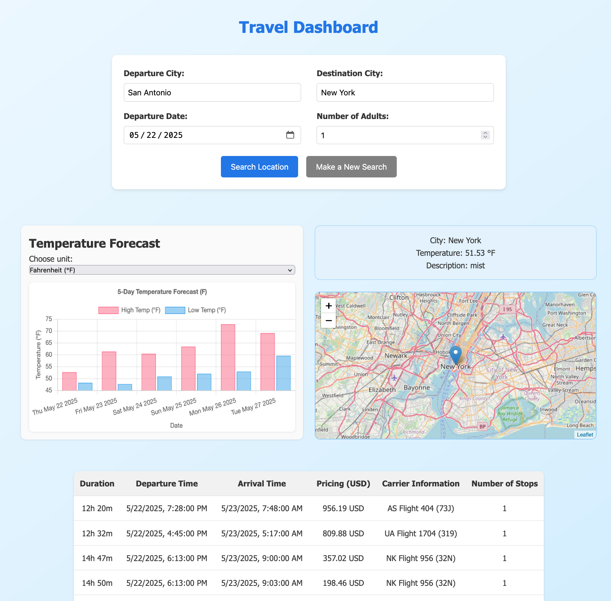
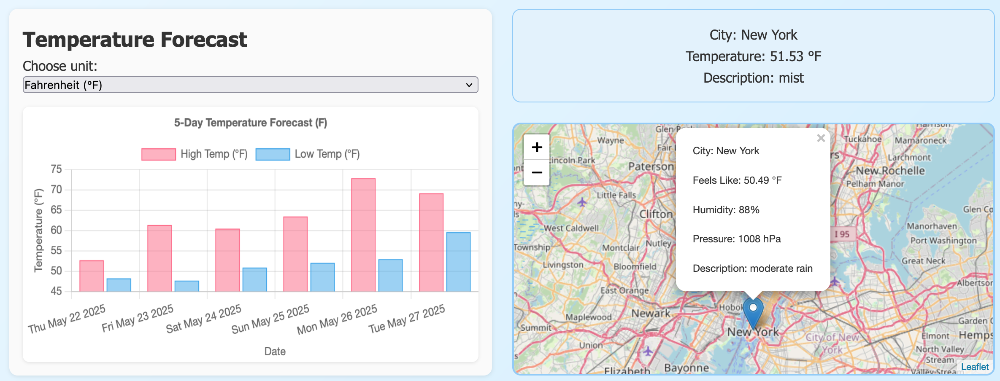

# Weather & Travel App — Project-3

## Project Disctription 
Our Weather and Travel App is an all-in-one travel planning tool designed to make your journey seamless and hassle-free. Users enter their departure and destination locations to generate:

* An interactive map outlining their travel route
* Up-to-date weather forecasts for the arrival week
* The latest flight offers tailored to their trip

By integrating location mapping, weather insights, and flight options, the app empowers travelers to make informed decisions and book trips effortlessly — the perfect companion for smart, stress-free travel.

Main page showing flight routes

Interactive route map with location details and Weekly weather forecast for destination

## Installation
* pip install amadeus
* pip install sdk

Working Project is found in "my_flask_app"
To run the app run the project code:
* python app.py

## Requirements
### Data and Delivery
* Data Documentation: Data components used in the project are thoroughly documented.
* Dataset Size: The dataset contains a minimum of 100 unique records.
* Database Usage: Data is stored in a database (e.g., SQL, MongoDB, SQLite).
* Technology Stack: The project utilizes a Python Flask API along with HTML/CSS, JavaScript, and the chosen database.
* 
### Back End
* Visualization Page: The page showcasing data visualizations functions without errors.
* Advanced JavaScript Usage: A JavaScript library not covered in the course is integrated into the project.
* Design Conformity: The project adheres to one of the specified design requirements:
* Leaflet or Plotly charts sourced from web-scraped data.
* Dashboard page featuring multiple charts referencing the same data.

### Visualizations
* Diverse Views: A minimum of three unique views are presented for the data.
* User Interaction: Multiple user-driven interactions (e.g., dropdowns, filters, zoom) are incorporated into the final page.
* Visual Clarity: Visualizations are presented clearly and in an easily digestible manner.
* User Interpretation: The data story is comprehensible for users of varying expertise levels.

### Group Presentation
* Participation: All group members actively contribute to the presentation.
* Relevance: The content presented is directly related to the project.
* Engagement: The presentation effectively maintains audience interest.
* Flow: Content, transitions, and conclusions seamlessly align within any time constraints.
